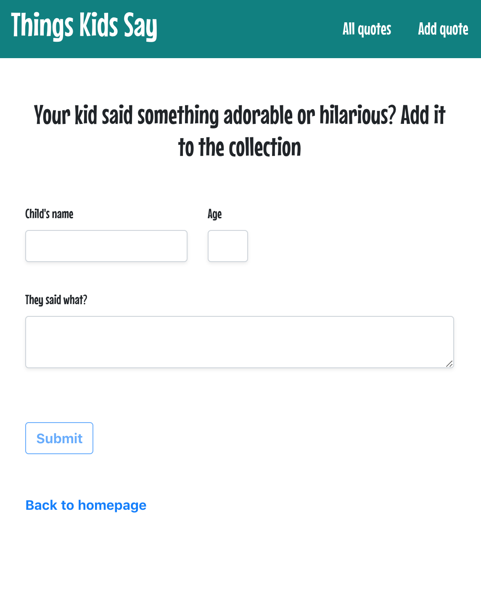

# Things Kids Say

## Table of Content
* [General Info](#general-info)
* [Technologies](#technologies)
* [Setup](#setup)
* [Features](#features)
* [Screenshots](#screenshots)

### General Info
I had the idea of building this app during a year in which I worked with a group of 4 year olds when I was constantly being struck by their innocent wisdom and antics. I compiled the funniest things they said during that time and posted them to a database which I created using MongoDB and using React as a client.

### Technologies
Project is created with:
* React utilizing React hooks
* CSS3
* Bootstrap

### Setup
- Clone the [API Repo](https://github.com/BC1985/things_kids_say_api) and run `npm start`.
- Clone this repo to your desktop and run `npm install` to install all the dependencies. When you're done, type `npm start`.

### Features 
* Random colors on landing page refresh 
* Responsive layout
* Input form for uploading quotes to database
* Get random quotes from database or full list

### Screenshots

